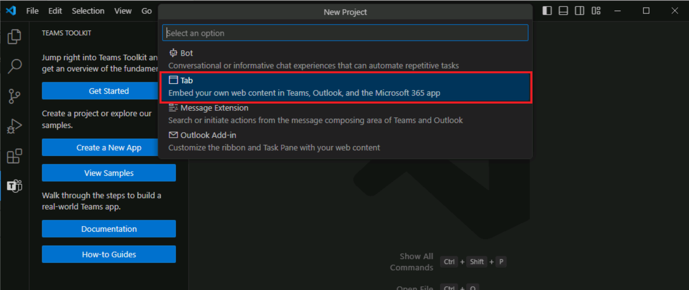
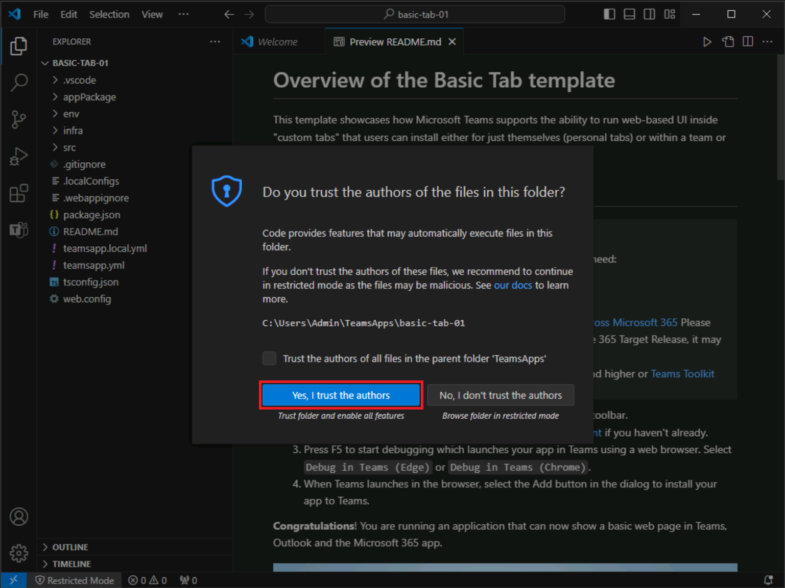
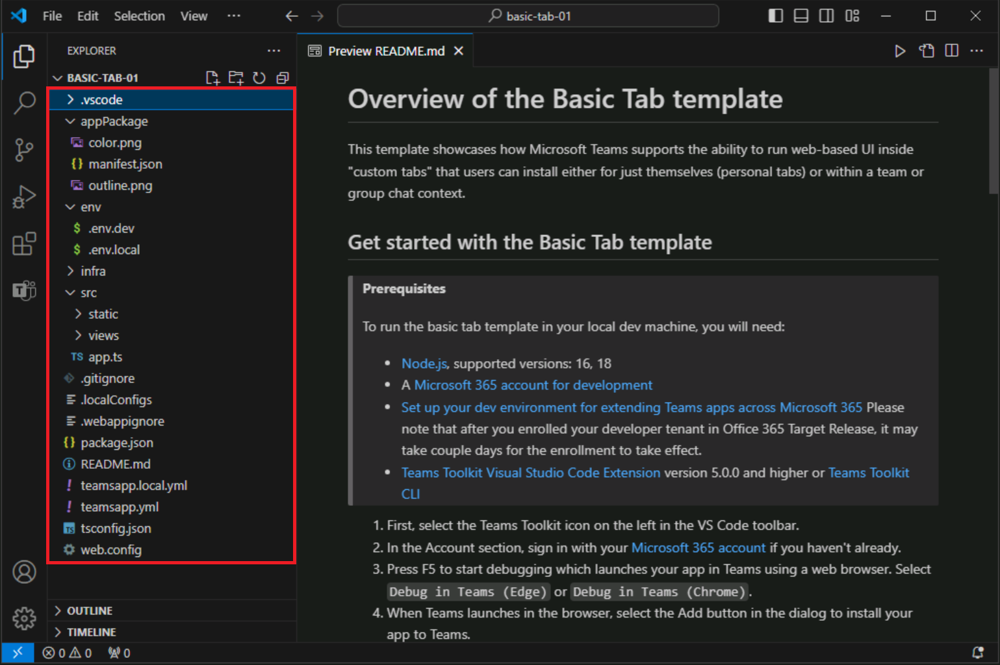

# Exercise 2: Create a Teams app using Teams Toolkit

Teams Toolkit for Visual Studio Code offers two methods for creating a new app. You can create a new app using the built-in templates provided by the toolkit. Additionally, Teams Toolkit for Visual Studio Code also provides a collection of samples that are ready for you to explore and create your base app from. 

In this exercise, you'll create your first Microsoft Teams app using the built-in templates.

## Task 1: Create a new Teams app

1. In the Visual Studio Code sidebar, select the **Teams Toolkit** button to open Teams Toolkit.
1. In Teams Toolkit, select **Create a New App**.

   

1. On the New Project menu, select** **Tab**.

   
   
1. When prompted to select a capability, select **Basic Tab**.
1. When prompted to select a programming language, select **TypeScript**.
1. When prompted to select a folder, select **Default folder** or choose a different file location.
1. **Enter an application name** of your choice for your basic tab app and select **enter**.
1. Teams Toolkit will scaffold a new app and open the project folder in Visual Studio Code.
1. You may receive a message from Visual Studio Code that asks if you trust the authors of the files in this folder. Select the **Yes, I trust the authors** button to continue.

   

1. Now you can view the project code, which includes:

- The Teams app code.
- Deployment and manifest files inside the appPackage folder.
- Environment variables inside the env folder.
- A README file that provides required steps to run, debug, and deploy the app.

  
