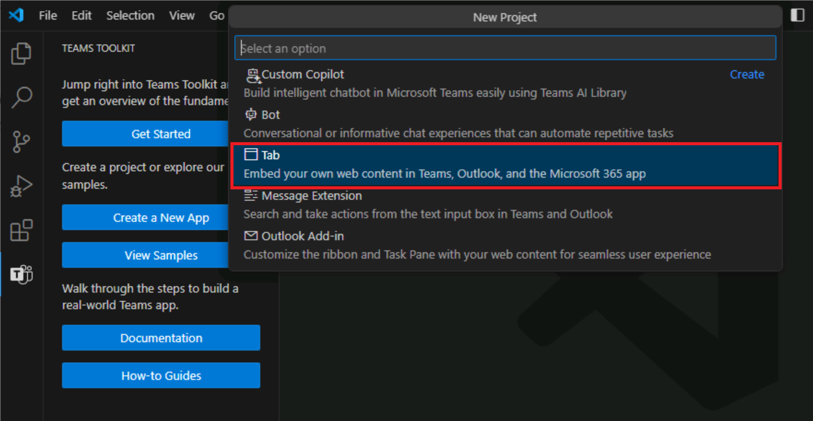
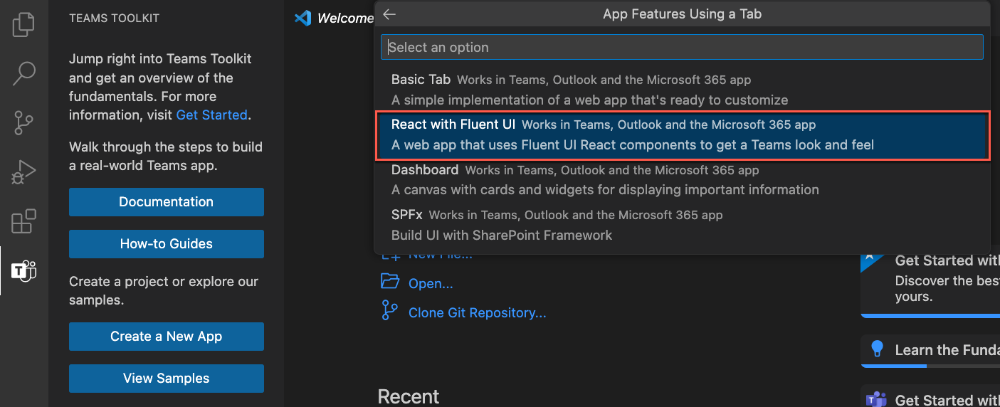
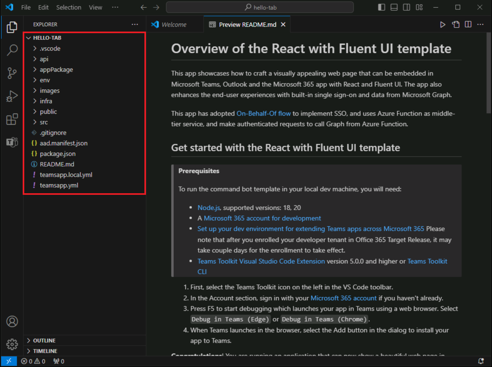
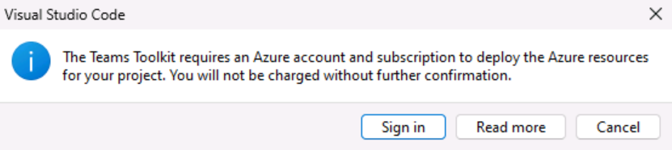
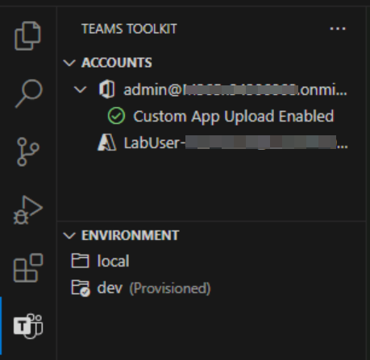
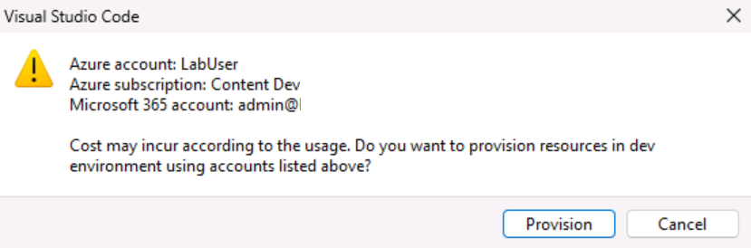
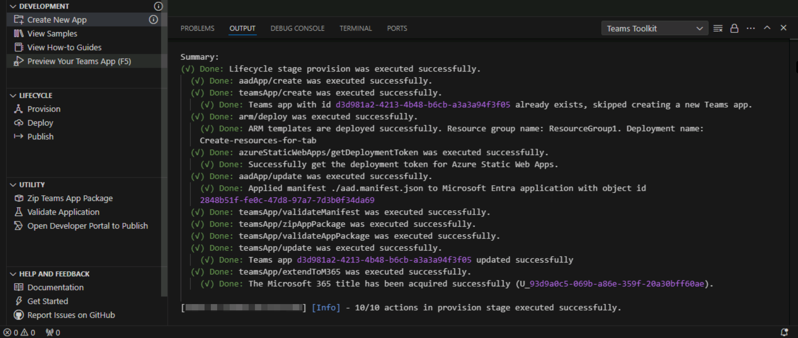

# Exercise 1: Create Azure resources to host a Teams tab app

In this exercise, you'll first create and provision a Teams tab app by using Teams Toolkit for Visual Studio Code. In a later exercise, you'll set up the app to be hosted in Azure.

**Note**:  The exercises in this training module use Teams Toolkit v5.8.0. The following steps assume the Teams Toolkit extension is installed.

## Task 1: Create a new tab app

1. In Visual Studio Code, on the Activity Bar, select the **Microsoft Teams** icon.

1. On the Teams Toolkit panel, select the **Create a New App** button.

1. From the options, select **Tab**.

    

1. Next, select **React with Fluent UI**.

    

1. From the options for the programming language, select **JavaScript**.

1. Select a **location** for the tab app project folder and all its files.

1. For the application name, enter **hello-tab** and select Enter.

1. Project scaffolding begins. When the project is scaffolded, a new Visual Studio Code window opens with the new project loaded.

    

1. In Visual Studio Code, select **Run > Start debugging** or select the **F5** key to start the debug session.

1. Visual Studio Code builds and starts the application. Run the debug session before you begin to provision any Azure resources.

1. When the app is tested successfully, stop running the app locally.

1. To end the debug session and stop running the app, you can either close the browser, select **Run > Stop Debugging**, or select **Shift+F5**.

## Task 2: Sign into Azure in Teams Toolkit

Sign into Azure using your **Azure subscription** account.

1. On the Activity Bar, select the **Microsoft Teams** icon.

1. On the Teams Toolkit panel, under **Accounts**, select **Sign in to Azure**.

    

1. In the dialog that appears, select **Sign in**.

    
    

## Task 3: Provision the resources

Now you can provision the resources your Teams tab app needs.

1. On the Teams Toolkit panel, under **Lifecycle**, select **Provision**.

    

1. Next, you need to select a resource group where you can provision the resources or create a new resource group by selecting the **New resource group** option on the **Select a resource group** menu.

    

1. The tool automatically suggests the resource group name like rg-hello-tab0989fd-dev. Select **Enter**.

1. Next, select the **location East US** for the new resource group and select **Enter**.

1. In a dialog to confirm your selection, select **Provision**.

    

1. Provisioning begins for all the resources you need to host the Teams tab app in Azure. Provisioning might take a while.

    
You've now successfully provisioned all the resources you need to host the Teams tab application.

Next, you'll deploy the source code of your app to these resources.
