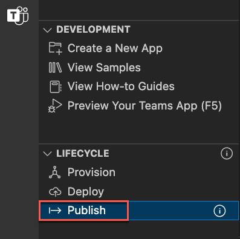
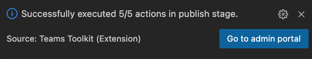
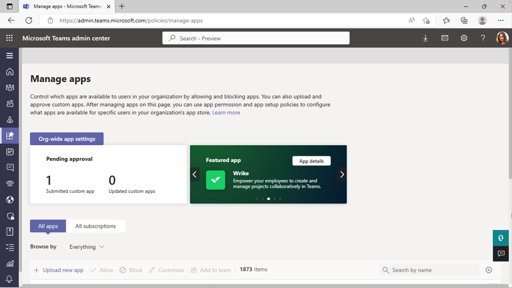
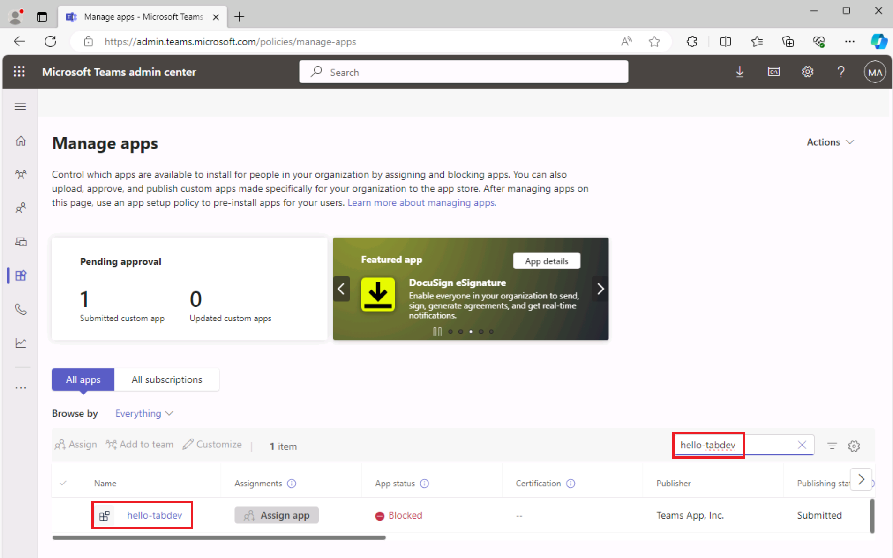
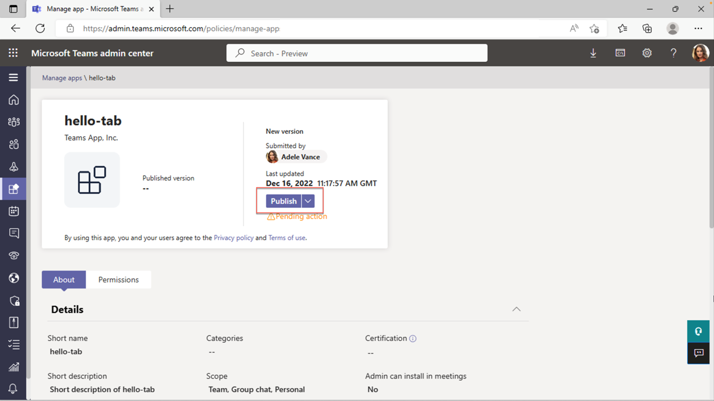
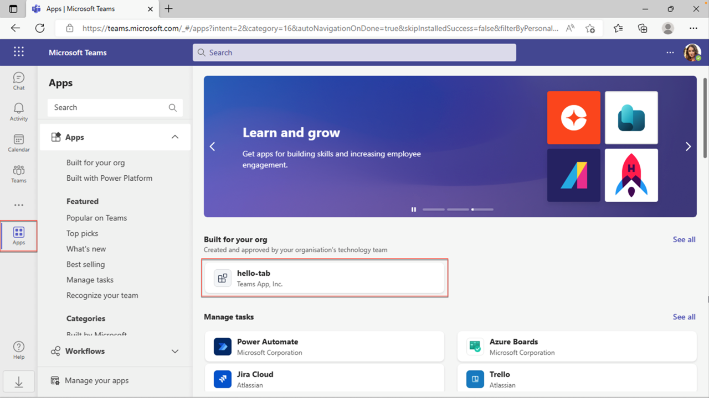
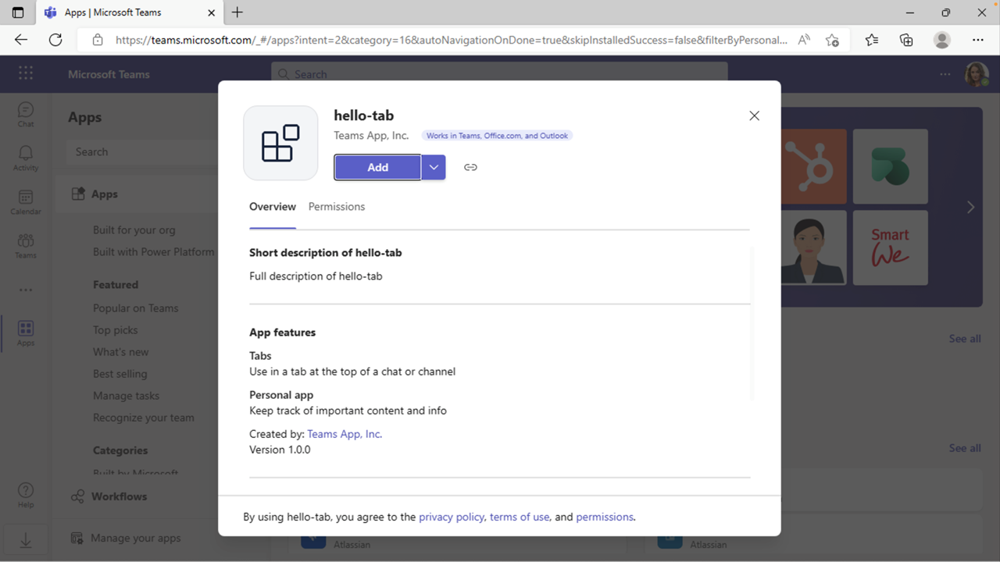
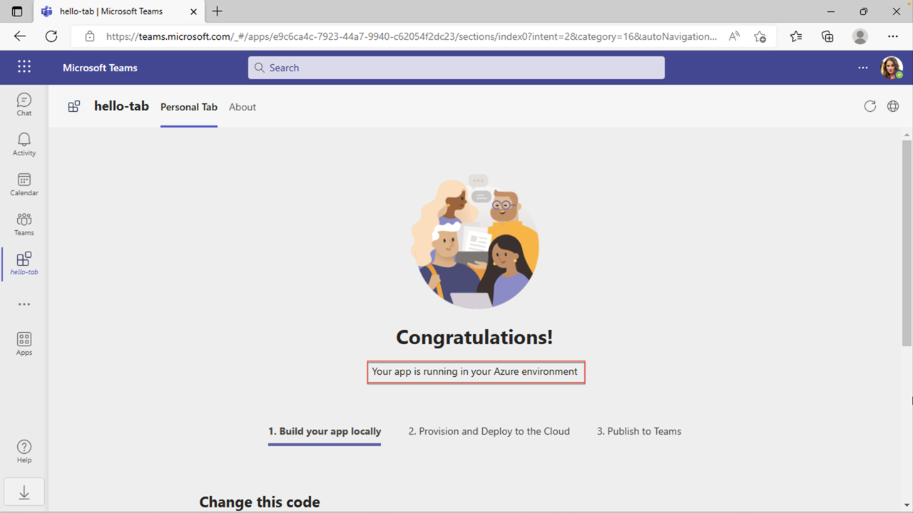

# Exercise 3: Publish your Teams tab app

In this exercise, you learn how to publish your app to the organization store.

## Task 1: Publish your app to the store

1. In Visual Studio Code, on the Activity Bar, select the **Microsoft Teams icon** to open the **Teams Toolkit panel**.

    a. 

1. On the Teams Toolkit panel, under **Lifecycle**, select **Publish**.

1. A dialog indicates that the app has been successfully published to the Microsoft Teams admin portal.

1. In the dialog, select **Go to admin portal** to open the **Microsoft Teams admin center**.  Sign in with your **Microsoft 365 tenant account**.

    a. 

    a. 

1. In the Teams admin center **Manage apps** menu, locate the **Search by name** textbox. 
1. Enter **hello-tab** to filter the list of apps. Then **select the app** to view the app details.

    

1. On the **hello-tab** app details panel, select **Publish**.

    

1. In the **Publish your custom app?** dialog, select **Publish**.

1. A green banner indicates that the hello-tab app has been published.

    

Now that your app is published in the organization store, open Microsoft Teams and install the app from the organization store.

## Task 2: Install the app from the store

1. Open the Microsoft Teams client or sign in to Microsoft Teams online ([teams.microsoft.com](teams.microsoft.com)) using your **Microsoft 365 tenant credentials**.
2. In Microsoft Teams, go to **Apps** to view the organization store. Under **Built for your org**, select the **hello-tab** tile.

    a. 

3. In the app installation dialog, select **Add**.

    a. 

4. The app opens, and the message **Your app is running in your Azure environment** appears.

    
