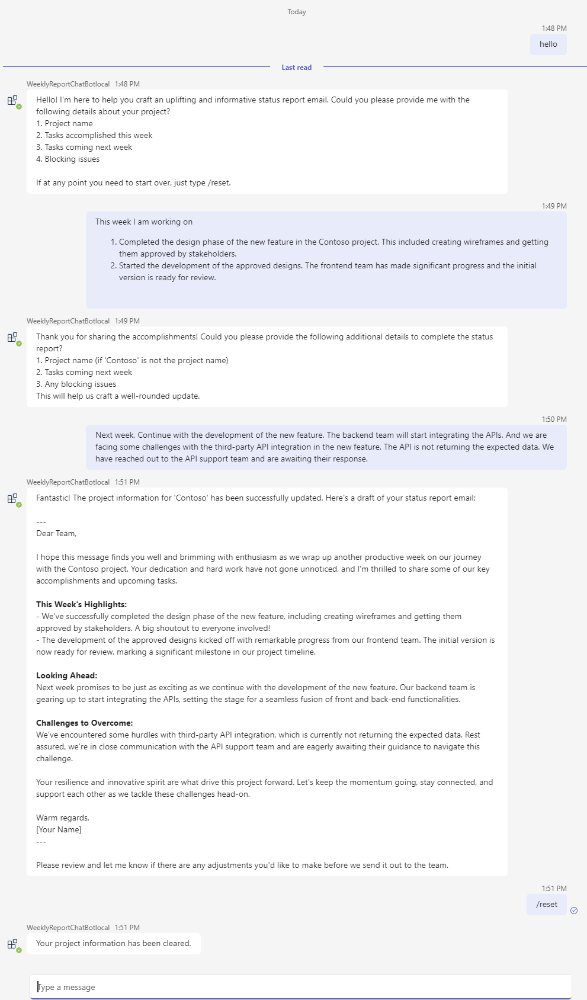

---
lab:
    title: 'Build a Bot with AI'
    module: 'Exercise 4'
---

# Exercise 4: Build a Bot with AI

## Scenario

Imagine you're a member of the IT Support team. You realize that compiling the Weekly Report is a very mechanical and time-consuming process. You wish to create an AI bot within MS Teams. By simply discussing the weekly work items and tasks for the upcoming week with the bot in a conversation, it can generate a well-formatted weekly report. This could significantly improve work efficiency.

## Exercise tasks

You need to complete the following tasks to complete the exercise:

1. Create a bot using Teams AI library
1. Connect to OpenAI service
1. Implement code functionality
1. Update prompts

**Estimated completion time:** 20 minutes

## Prerequisites

To run the AI Chat Bot template on your local development machine, you not only need to meet the resource requirements mentioned in the previous lab, but also require an OpenAI account. This account can be either from [OpenAI](https://platform.openai.com/) or [Azure OpenAI](https://aka.ms/oai/access) .

## Task 1: Create a bot using Teams AI library

Use the AI Chat Bot template to create a new bot:

1. Open Visual Studio Code.
1. On the sidebar, select the **Microsoft Teams** icon to open the **TEAMS TOOLKIT** panel.
1. Select **Create a New App** button.
1. From the **New Project** menu, select **Bot** then select **AI Chat Bot** to build a command bot.
1. For Programming Language, select **TypeScript**.
1. For **workspace folder** select or create a folder to store your project files on your computer.
1. For **Application name**, enter **WeeklyReportChatBot** then press **Enter**. Teams Toolkit will scaffold a new app and open the project folder in Visual Studio Code.
1. You may receive a message from Visual Studio Code that asks if you trust the authors of the files in this folder. Select the **Yes, I trust the authors** button to continue.
1. Review the project directories and files using the Explorer in Visual Studio Code to familiarize yourself with the source code.

## Task 2: Connect to OpenAI service

### Use OpenAI account
1. Open the file `.env.local.user` from the `env` folder.
1. In the file *env/.env.local.user*, fill in your OpenAI key `SECRET_OPENAI_API_KEY=<your-key>`.
1. Open the file `app.ts` from the `src` folder.
1. (Optional) Since this demonstration uses the model's planning capabilities, gpt-4 offers a significant improvement over the default gpt-3.5 output. In the file *src/app.ts*, in the *Create AI components* section, change `defaultModel: "gpt-3.5-turbo"` to `defaultModel: "gpt-4"` or `defaultModel: "gpt-4-turbo"`.

### User Azure OpenAI
1. Open the file `.env.local.user` from the `env` folder.
1. In the file *env/.env.local.user*, fill in your Azure OpenAI key `SECRET_AZURE_OPENAI_API_KEY=<azure-openai-api-key>` and Azure OpenAI Endpoint `SECRET_AZURE_OPENAI_ENDPOINT=<azure-openai-endpoint>`.
1. Open the file `app.ts` from the `src` folder.
1. In the file *src/app.ts*, *Create AI components* section, comment out *"Use OpenAI"* part and uncomment *"use Azure OpenAI"* part, then update `azureDefaultDeployment` to your own model deployment name.
    ```typescript
    // Create AI components
    const model = new OpenAIModel({
      // Use OpenAI
      // apiKey: config.openAIKey,
      // defaultModel: "gpt-3.5-turbo",

      // Uncomment the following lines to use Azure OpenAI
      azureApiKey: config.azureOpenAIKey,
      azureDefaultDeployment: "gpt-4", //update to your model name
      azureEndpoint: config.azureOpenAIEndpoint,

      useSystemMessages: true,
      logRequests: true,
    });
    ```

## Task3: Implement code functionality

1. Open the file *src/app.ts*. We will modify this file according to the following steps. The final file can be referenced in [app.ts](../../../Allfiles/Labs/Guided-Exercise5/app.ts).
1. Add `TurnContext` import from `botbuilder` 
    ```typescript
    import { MemoryStorage, TurnContext } from "botbuilder";
    ```
1. Add `DefaultConversationState` and `TurnState` imports from `@microsoft/teams-ai`
    ```typescript
    // See https://aka.ms/teams-ai-library to learn more about the Teams AI library.
    import { Application, ActionPlanner, OpenAIModel, PromptManager, DefaultConversationState, TurnState } from "@microsoft/teams-ai";
    ```
1. In the file *src/app.ts* before the section *Create AI components*,  add `ProjectInformation` interface and `ApplicationTurnState` definition.
    ```typescript
    // Register project information item related handlers
    interface ProjectInformation {
      projectName: string;
      tasksAccomplished: string;
      tasksComing: string;
      blockingIssues: string;
    }

    // Strongly type the applications turn state
    interface ConversationState extends DefaultConversationState {
      greeted: boolean;
      projectInformation: ProjectInformation;
    }
    type ApplicationTurnState = TurnState<ConversationState>;

    // Create AI components
    ```
1. In the file *src/app.ts* after the section *Define storage and application*, add the bot's response to messages.
    ```typescript
    // List for /reset command and then delete the conversation state
    app.message('/reset', async (context: TurnContext, state: ApplicationTurnState) => {
      state.deleteConversationState();
      await context.sendActivity("Your project information has been cleared.");
    });

    // Define the method for updating project information
    app.ai.action("updateProjectInformation", async (context: TurnContext, state: ApplicationTurnState, parameters: ProjectInformation) => {
      const conversation = ensureStateInitialized(state);
      if (parameters){
        if (parameters.projectName) {
          conversation.projectInformation.projectName = parameters.projectName;
        }
        if (parameters.tasksAccomplished) {
          conversation.projectInformation.tasksAccomplished = parameters.tasksAccomplished;
        } 
        if (parameters.tasksComing) {
          conversation.projectInformation.tasksComing = parameters.tasksComing;
        }
        if (parameters.blockingIssues) {
          conversation.projectInformation.blockingIssues = parameters.blockingIssues;
        }
        return `Project information was updated. Think about your next action`;
      }
    });

    // This method is used to make sure that the conversation state is initialized.
    function ensureStateInitialized(state: ApplicationTurnState): ConversationState {
      if (state.conversation.projectInformation == undefined) {
        state.conversation.projectInformation = {
          projectName: "",
          tasksAccomplished: "",
          tasksComing: "",
          blockingIssues: "",
        };
      }
      return state.conversation;
    }
    ```

## Task4: Prompt Updates
1. Update the `skprompt.txt` file in the *src/prompts/chat* folder.  The final file can be referenced in [skprompt.txt](../../../Allfiles/Labs/Guided-Exercise5/skprompt.txt)
    ```txt
    You are a Teams Bot. Here is how you will act.
    Team Bot will adopt an encouraging and positive tone in all its interactions. This will be reflected in the creation of status report emails, ensuring that they are not only informative but also boost morale and foster a joyous team spirit. The language used will be engaging and supportive, aiming to excite and inspire the team while maintaining a professional undercurrent appropriate for the communication between a project manager and their team and stakeholders in a professional corporate setting. The Teams Bot will always ask for information from the user when it is not provided. 
    # Teams Bot will ask for the following project information to make status report emails:
    1. project name
    2. tasks accomplished this week
    3. tasks coming next week
    4. blocking issues

    # Status report task description like SCRUM style summary

    # Then, the users will type in the parameters and the bot will make the email.

    # For the first time, users are informed that they can clear the entered ProjectInformation with /reset command.

    # THE SUMMARY MUST BE:
    - G RATED
    - WORKPLACE / FAMILY SAFE
    NO SEXISM, RACISM OR OTHER BIAS/BIGOTRY.

    project information:
    {{$conversation.projectInfomation}}

    Typescript Interfaces:
    interface ProjectInformation {
        projectName: string;
        tasksAccomplished: string;
        tasksComing: string;
        blockingIssues: string;
    }
    ```
1. Update `max_tokens` and `temperature` parameters in the file `src/prompts/chat/config.json`. Also, add an augmentation node parameter. The final result is as follows.  And it can be referenced in [config.json](../../../Allfiles/Labs/Guided-Exercise5/config.json)
    ```json
    {
      "schema": 1,
      "description": "AI Bot",
      "type": "completion",
      "completion": {
        "max_tokens": 2500,
        "temperature": 0.1,
        "top_p": 0.0,
        "presence_penalty": 0.6,
        "frequency_penalty": 0.0
      },
      "augmentation": {
        "augmentation_type": "monologue"
      }
    }
    ```
1. Create a new file named `actions.json` in the *src/prompts/chat* folder. The file content is as follows. This file defines the methods for the AI to use. And it can be referenced in [actions.json](../../../Allfiles/Labs/Guided-Exercise5/actions.json)
    ```json
    [
        {
            "name": "updateProjectInformation",
            "description": "updates the information for the existing project",
            "parameters": {
                "type": "object",
                "properties": {
                    "projectName": {
                        "type": "string",
                        "description": "The name of the project"
                    },
                    "tasksAccomplished": {
                        "type": "string",
                        "description": "tasks that have been accomplished"
                    },
                    "tasksComing": {
                        "type": "string",
                        "description": "tasks that are coming up"
                    },
                    "blockingIssues": {
                        "type": "string",
                        "description": "any blocking issues"
                    }
                }
            }
        }
    ]
    ```

## Check your work

Run your app locally to test the functionality:

1. Open the **TEAMS TOOLKIT** pannel. In the **DEVELOPMENT** menu, select **Preview Your Teams App** (or use the `F5` key) then select **Debug in Teams ()** with your preferred browser.  
2. Teams Toolkit will provision and run your app locally in a browser.
3. On the app installation dialog in the browser, select **Add** to install your Teams app.  Teams opens a conversation with your bot installed.
4. After entering greeting information, follow the prompts to enter the project name, completed tasks, uncompleted tasks, and blocking tasks. The AI bot will then generate a Weekly Report similar to the screenshot below.
5. Verify that the bot replies the correct answer as follows. 
