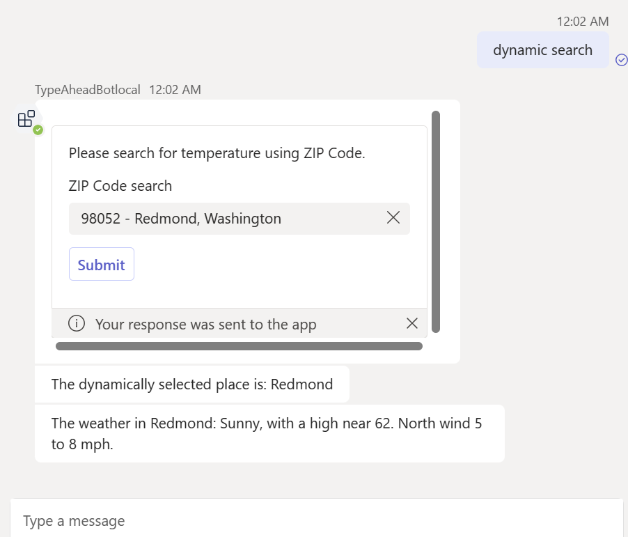

---
lab:
    title: 'Build a Basic Bot'
    module: 'Exercise 6'
---

# Exercise 6: Build a Basic Bot

## Scenario
Suppose you have been asked to help the IT Support team build a Teams bot. This bot will have the capability to retrieve the abbreviation for a given state and also fetch the current weather conditions for a specific area based on its ZIP Code.

## Exercise tasks
In this exercise, you will use the Teams Toolkit template to create a simple Teams bot. This bot will utilize the Teams AI library to process messages with users and include interactions using Adaptive Cards. Please note that this exercise does not involve interactions between the Teams AI library and LLMs.

You need to complete the following tasks to complete the exercise:

1. Create a Teams bot using the Teams Toolkit basic bot template.
1. Integrate the Teams AI library.
1. Create Adaptive Cards.
1. Handle messages.

**Estimated completion time:**  15 minutes

## Task 1: Create a Teams Bot Using the Teams Toolkit Template

Use the Command Bot template to create a new bot:

1. Open Visual Studio Code.
1. On the sidebar, select the **Microsoft Teams** icon to open the **TEAMS TOOLKIT** panel.
1. Click **Create a New App** button.
1. From the **New Project** menu, select **Bot** then select **Basic Bot** to build a simple bot.
1. For Programming Language, select **TypeScript**.
1. For **workspace folder** select or create a folder to store your project files on your computer.
1. For **Application name**, enter **TypeAheadBot** then press **Enter**. Teams Toolkit will scaffold a new app and open the project folder in Visual Studio Code.
1. You may receive a message from Visual Studio Code that asks if you trust the authors of the files in this folder. Select the **Yes, I trust the authors** button to continue.
1. Review the project directories and files using the Explorer in Visual Studio Code to familiarize yourself with the source code.

## Task 2: Integrate the Teams AI Library

1. In Visual Code, press ``Ctrl + ` `` to open the Terminal.
1. In the Terminal, run the following command to install the required Teams AI library and axios packages. The axios package is a promise-based HTTP client that we will use in this exercise to call web APIs.
   ```shell
   npm install @microsoft/teams-ai axios --save
   ```
1. Create an `app.ts` file in the project root directory. Add the following code to the file to define and export the `app` object.
   ``` typescript
   // See https://aka.ms/teams-ai-library to learn more about the Teams AI library.
   import { Application } from "@microsoft/teams-ai";
   
   const app = new Application();
   
   export default app;
   ```
1. Open the `index.ts` file in the project root directory. Replace the reference to `TeamsBot` with the `app` object. The final file of `index.ts` can be referenced in [index.ts](../../../Allfiles/Labs/Guided-Exercise6/index.ts).
   1. Replace *This bot's main dialog.* section with the following code:
      
      Insert code snippet
      ``` typescript
      import app from "./app";
      ``` 
      Remove code snippet
      ``` typescript
      // This bot's main dialog.
      import { TeamsBot } from "./teamsBot";
      ```
   1. Remove code snippet *Create the bot that will handle incoming messages.*
      ``` typescript
      // Create the bot that will handle incoming messages.
      const bot = new TeamsBot();
      ```
   1. Modify the code snippet *Listen for incoming requests.* To use the `app` object to respond to messages.
      ``` typescript
      // Listen for incoming requests.
      server.post("/api/messages", async (req, res) => {
        await adapter.process(req, res, async (context) => {
          await app.run(context); //replace bot with app object
        });
      });
      ```

## Task 3: Create Adaptive Cards

1. Create a folder named `cards` in this project root directory.
1. In the `cards` folder, create a file named `staticSearchCard.ts` with the following content. The final file of `staticSearchCard.ts` can be referenced in [staticSearchCard.ts](../../../Allfiles/Labs/Guided-Exercise6/staticSearchCard.ts).
   ```typescript
   import { Attachment, CardFactory } from 'botbuilder';

    export function createStaticSearchCard(): Attachment {
        return CardFactory.adaptiveCard({
            $schema: 'http://adaptivecards.io/schemas/adaptive-card.json',
            version: '1.2',
            type: 'AdaptiveCard',
            body: [
                {
                    text: 'Please search for the list of state abbreviations from static list.',
                    wrap: true,
                    type: 'TextBlock'
                },
                {
                    columns: [
                        {
                            width: 'stretch',
                            items: [
                                {
                                    choices:
                                        [
                                            { title: 'Alabama', value: 'AL' },
                                            { title: 'Alaska', value: 'AK' },
                                            { title: 'Arizona', value: 'AZ' },
                                            { title: 'Arkansas', value: 'AR' },
                                            { title: 'California', value: 'CA' },
                                            { title: 'Colorado', value: 'CO' },
                                            { title: 'Connecticut', value: 'CT' },
                                            { title: 'Delaware', value: 'DE' },
                                            { title: 'Florida', value: 'FL' },
                                            { title: 'Georgia', value: 'GA' },
                                            { title: 'Hawaii', value: 'HI' },
                                            { title: 'Idaho', value: 'ID' },
                                            { title: 'Illinois', value: 'IL' },
                                            { title: 'Indiana', value: 'IN' },
                                            { title: 'Iowa', value: 'IA' },
                                            { title: 'Kansas', value: 'KS' },
                                            { title: 'Kentucky', value: 'KY' },
                                            { title: 'Louisiana', value: 'LA' },
                                            { title: 'Maine', value: 'ME' },
                                            { title: 'Maryland', value: 'MD' },
                                            { title: 'Massachusetts', value: 'MA' },
                                            { title: 'Michigan', value: 'MI' },
                                            { title: 'Minnesota', value: 'MN' },
                                            { title: 'Mississippi', value: 'MS' },
                                            { title: 'Missouri', value: 'MO' },
                                            { title: 'Montana', value: 'MT' },
                                            { title: 'Nebraska', value: 'NE' },
                                            { title: 'Nevada', value: 'NV' },
                                            { title: 'New Hampshire', value: 'NH' },
                                            { title: 'New Jersey', value: 'NJ' },
                                            { title: 'New Mexico', value: 'NM' },
                                            { title: 'New York', value: 'NY' },
                                            { title: 'North Carolina', value: 'NC' },
                                            { title: 'North Dakota', value: 'ND' },
                                            { title: 'Ohio', value: 'OH' },
                                            { title: 'Oklahoma', value: 'OK' },
                                            { title: 'Oregon', value: 'OR' },
                                            { title: 'Pennsylvania', value: 'PA' },
                                            { title: 'Rhode Island', value: 'RI' },
                                            { title: 'South Carolina', value: 'SC' },
                                            { title: 'South Dakota', value: 'SD' },
                                            { title: 'Tennessee', value: 'TN' },
                                            { title: 'Texas', value: 'TX' },
                                            { title: 'Utah', value: 'UT' },
                                            { title: 'Vermont', value: 'VT' },
                                            { title: 'Virginia', value: 'VA' },
                                            { title: 'Washington', value: 'WA' },
                                            { title: 'West Virginia', value: 'WV' },
                                            { title: 'Wisconsin', value: 'WI' },
                                            { title: 'Wyoming', value: 'WY' }
                                        ],
                                    style: 'filtered',
                                    placeholder: 'Search for a state abbreviation',
                                    id: 'choiceSelect',
                                    type: 'Input.ChoiceSet'
                                }
                            ],
                            type: 'Column'
                        }
                    ],
                    type: 'ColumnSet'
                }
            ],
            actions: [
                {
                    id: 'staticSubmit',
                    type: 'Action.Submit',
                    title: 'Submit',
                    data: {
                        verb: 'StaticSubmit'
                    }
                }
            ]
        });
    }
   ```

1. In the `cards` folder, create a file named `dynamicSearchCard.ts` with the following content. The final file of `dynamicSearchCard.ts` can be referenced in [dynamicSearchCard.ts](../../../Allfiles/Labs/Guided-Exercise6/dynamicSearchCard.ts).
   ```typescript
   import { Attachment, CardFactory } from 'botbuilder';

   export function createDynamicSearchCard(): Attachment {
        return CardFactory.adaptiveCard({
            $schema: 'http://adaptivecards.io/schemas/adaptive-card.json',
            version: '1.6',
            type: 'AdaptiveCard',
            body: [
                {
                    text: 'Please search for temperature using ZIP Code.',
                    wrap: true,
                    type: 'TextBlock'
                },
                {
                    columns: [
                        {
                            width: 'stretch',
                            items: [
                                {
                                    choices: [],
                                    'choices.data': {
                                        type: 'Data.Query',
                                        dataset: 'locations',
                                        value: 'value'
                                    },
                                    id: 'choiceSelect',
                                    type: 'Input.ChoiceSet',
                                    placeholder: 'ZIP Code',
                                    label: 'ZIP Code search',
                                    isRequired: false,
                                    errorMessage: 'There was an error test.',
                                    isMultiSelect: false,
                                    style: 'filtered'                                
                                }
                            ],
                            type: 'Column'
                        }
                    ],
                    type: 'ColumnSet'
                }
            ],
            actions: [
                {
                    id: 'submitdynamic',
                    type: 'Action.Submit',
                    title: 'Submit',
                    data: {
                        verb: 'DynamicSubmit'
                    }
                }
            ]
        });
    }

   ```

## Task 4: Handle the command

In this step, we will add message response functionality to the `app` object.

1. Open the `app.ts` file.
1. Below the code that creates the app object `const app = new Application();`, add the following code to handle different messages.
    ``` typescript
    interface SubmitData {
        choiceSelect?: string;
    }

    app.message(/static/i, async (context, _state) => {
        const attachment = createStaticSearchCard();
        await context.sendActivity({ attachments: [attachment] });
    });

    app.message(/dynamic/i, async (context, _state) => {
        const attachment = createDynamicSearchCard();
        await context.sendActivity({ attachments: [attachment] });
    });

    // Listen for query from dynamic search card
    app.adaptiveCards.search('locations', async (context: TurnContext, state: TurnState, query) => {
        // Format search results
        const locations: AdaptiveCardSearchResult[] = [];
        // Execute query
        const searchQuery = query.parameters['queryText'] ?? '';
        if (searchQuery.length < 4) {
            return locations;
        }   

        const response = await axios.get(
            `https://zip-api.eu/api/v1/codes/postal_code=US-${searchQuery}*`
        );

        interface DataObject {
            state: string;
            place_name: string;
            postal_code: string;
            lat:string
            lng:string
        };

        //response data is an array of objects or an object
        response.data = Array.isArray(response.data) ? response.data : [response.data];
        response.data.forEach((obj: DataObject) => {
            const result: AdaptiveCardSearchResult = {
                title: `${obj.postal_code} - ${obj.place_name}, ${obj.state}`,
                value: `${obj.postal_code}|${obj.place_name}|${obj.lat}|${obj.lng}`
            };
            locations.push(result);
        });

        // Return search results
        return locations;
    });

    // Listen for submit buttons
    app.adaptiveCards.actionSubmit('DynamicSubmit', async (context, _state, data: SubmitData) => {
        let [postalCode, placeName, lat, lon] = data.choiceSelect?.split('|') ?? [];
        await context.sendActivity(`The dynamically selected place is: ${placeName}`);
        const weatherLocation = await axios.get(
            `https://api.weather.gov/points/${lat},${lon}`
        );
        const forcast = await axios.get(weatherLocation.data.properties.forecast);
        await context.sendActivity(`The weather in ${placeName}: ${forcast.data.properties.periods[0].detailedForecast}`);
        });

        app.adaptiveCards.actionSubmit('StaticSubmit', async (context, _state, data: SubmitData) => {
        await context.sendActivity(`The statically selected option is: ${data.choiceSelect}`);
        });

        // Listen for ANY message to be received. MUST BE AFTER ANY OTHER HANDLERS
        app.activity(ActivityTypes.Message, async (context, _state) => {
        await context.sendActivity(`Try saying "static search" or "dynamic search".`);
    });
    ```

1. At the top of the file `app.ts` file, update related references as the following. The final file of `app.ts` can be referenced in [app.ts](../../../Allfiles/Labs/Guided-Exercise6/app.ts).
    
    Updated
    ```` typescript
    import { ActivityTypes, TurnContext } from "botbuilder";
    import { createStaticSearchCard } from "./cards/staticSearchCard";
    import { createDynamicSearchCard } from "./cards/dynamicSearchCard";
    import axios from "axios";
    // See https://aka.ms/teams-ai-library to learn more about the Teams AI library.
    import { Application, TurnState, AdaptiveCardSearchResult } from "@microsoft/teams-ai";
    ````
    Previous
    ```` typescript
    // See https://aka.ms/teams-ai-library to learn more about the Teams AI library.
    import { Application } from "@microsoft/teams-ai";
    ````    

## Check your work

Run your app locally to test the functionality:

1. Open the **TEAMS TOOLKIT** pannel. In the **DEVELOPMENT** menu, select **Preview Your Teams App** (or use the `F5` key) then select **Debug in Teams ()** with your preferred browser.  
1. Teams Toolkit will provision and run your app locally in a browser.
1. On the app installation dialog in the browser, select **Add** to install your Teams app.  Teams opens a conversation with your bot installed.
1. In the message dialog box, enter `static search` and press Enter. The bot will return an Adaptive Card.
1. In the input box, select or enter a state name and click the **Submit** button. The bot will return the abbreviation for that state name. 
1. In the message dialog box, enter `dynamic search` and press Enter.
1. In the input dialog box, enter a US ZIP Code and click the **Submit** button. The bot will return the current weather for that area. 